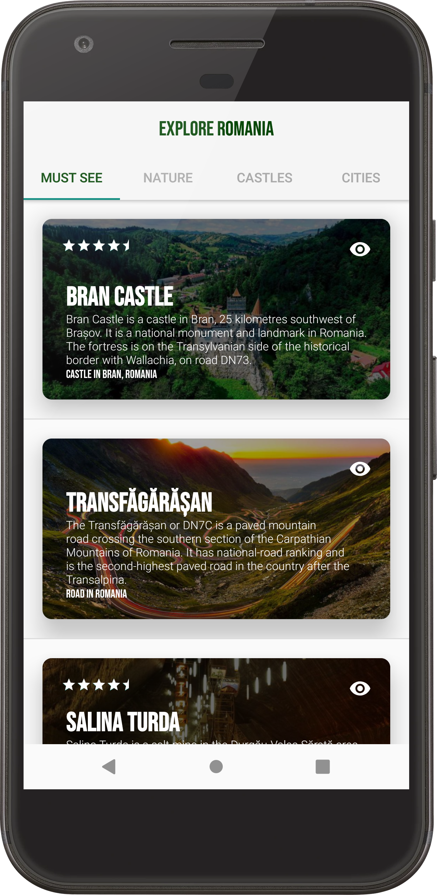
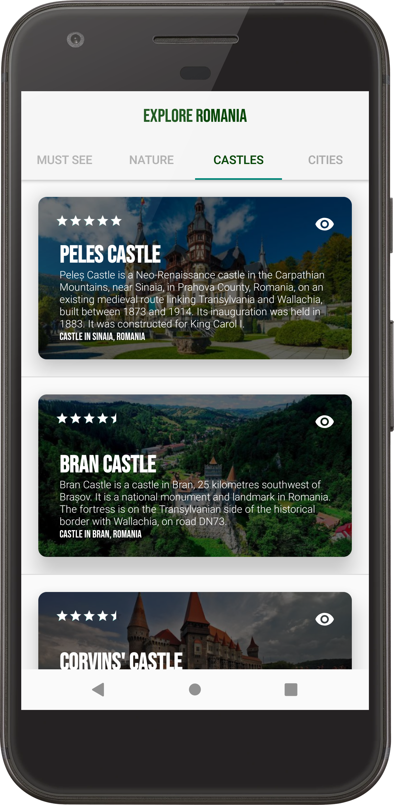
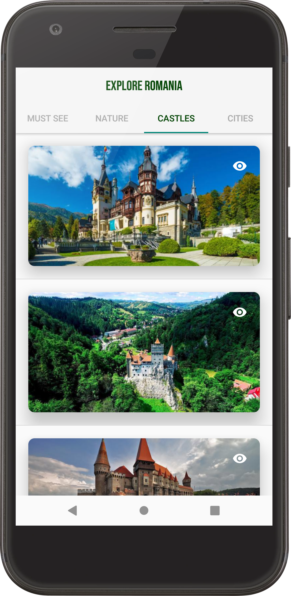

# Tour Guide App

## Project Overview

In this project I had a chance to combine and practice everything I have learned in the Multi-Screen Apps section of the Udacity's [Android Basics by Google Nanodegree](https://www.udacity.com/course/android-basics-nanodegree-by-google--nd803) program. I learned how to make my own multi-screen Android app to share information about attractions, restaurants, public places, or events in the country I was born in.

The goal was to create a Tour Guide App which presents relevant information to a user who’s visiting your city or country. The app can list top attractions, restaurants, public places, or events for the city. It can contain all the best known secrets that only locals know.

## Screenshots

The app it's quite simple in it's design. The user can select the tab that in interested in and scroll through a list of top attractions. Tapping on the eye icon will hide/reveal some details about the given atraction.

 

 

<table>
  <tr>
    <td>With details</td>
    <td>Without details</td>
  </tr>
  <tr>
    <td></td>
    <td></td>
  </tr>
  <tr>
    <td></td>
    <td></td>
  </tr>
 </table>
 
